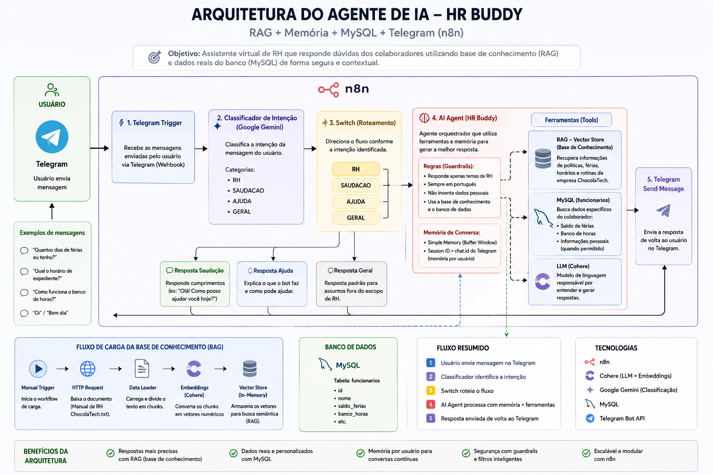

# 🚀 Imersão Agentes de IA - Alura e ONE

Bem-vindo ao repositório da **Imersão Agentes de IA** da **Alura** com a **Oracle Next Education**. Este projeto documenta a jornada prática de construção de agentes inteligentes do zero, explorando desde a ingestão de dados não estruturados até a implantação de um assistente virtual autônomo no Telegram.

O grande diferencial deste projeto é a criação de uma inteligência artificial com contexto real, reduzindo alucinações através de RAG (Retrieval-Augmented Generation) e conectando-se a dados estruturados em banco de dados.

---

## 🧠 Arquitetura do Projeto

O assistente construído atua como o "HR Buddy" (Assistente de RH da ChocolaTech), capaz de responder a dúvidas sobre políticas da empresa e consultar saldos de férias/banco de horas de funcionários específicos.

O desenvolvimento foi dividido em 3 etapas fundamentais:

### 📚 Aula 01: O Cérebro da IA (RAG e Embeddings)
Nesta etapa, construímos a base de conhecimento do agente para que ele responda com base em fatos documentados, não em alucinações.
* **Fluxo (`workflows/01-load-data-flow.json`):** Um pipeline de ingestão de dados no n8n.
* **Como funciona:** O fluxo faz uma requisição HTTP para ler o Manual de RH, converte os textos em vetores matemáticos usando **Cohere Embeddings** e armazena tudo em um banco de dados vetorial em memória (Vector Store).

### 🗄️ Aula 02: Memória e Dados Estruturados (SQL)
Integramos a inteligência aos dados do mundo real, permitindo que a IA consulte bancos de dados tradicionais de forma dinâmica.
* **Fluxo (`workflows/02-fluxo-rh-agente.json`):** Criação do AI Agent híbrido.
* **Como funciona:** O agente agora possui "Hybrid Power". Ele usa a base de conhecimento (Vector Store) para dúvidas gerais e acessa o **MySQL** para buscar dados específicos de funcionários. Utilizamos parâmetros dinâmicos (`$fromAI`) para que a própria IA extraia o nome do usuário da conversa e faça a query SQL no formato correto (`LIKE %Nome%`).

### 📱 Aula 03: Ganhando o Mundo (Telegram, Guardrails e Sessões)
Tiramos o projeto do ambiente de testes e o transformamos em um aplicativo real e seguro. E como desafio, foi proposto melhorar, nós mesmos, a estrutura, como foi apresentado a baixo.
* **Fluxo (`workflows/03-bot-telegram-guardrails.json`):** O cérebro ganha uma interface de comunicação.
* **Como funciona:** 
  * **Telegram Integration:** O fluxo reage a mensagens via Webhook do Telegram.
  * **Guardrails (Filtros):** Utilizei o **Google Gemini** como um classificador de intenções inicial. Escolhido por ser total *free-tier* e simples de configurar via Google API Studio. Ele analisa a mensagem e a categoriza em (RH, SAUDAÇÃO, AJUDA ou GERAL). O fluxo utiliza um nó *Switch* para barrar assuntos fora do escopo, garantindo que o bot fale apenas sobre RH.
  * **Session ID:** Implementação de memória individual. O ID do chat do Telegram é usado como chave de sessão, permitindo que o bot lembre o contexto de cada usuário de forma separada.

---

## 🛠️ Tecnologias Utilizadas

* **[n8n](https://n8n.io/):** Plataforma de automação visual baseada em nós, onde toda a orquestração do fluxo de IA e integrações foi montada.
* **[Cohere](https://cohere.com/):** Modelos de linguagem (LLM) para processamento de texto e geração de embeddings (`embed-multilingual-v3.0`).
* **[Google Gemini](https://deepmind.google/technologies/gemini/):** Utilizado como LLM classificador (Guardrail) para roteamento lógico (`gemini-2.5-flash`).
* **MySQL:** Banco de dados relacional para gerenciar as informações estruturadas dos funcionários.
* **Telegram API:** Interface final de comunicação com o usuário.
* **Conceitos:** RAG, Embeddings, Agents, Tools, Memory Buffer, Guardrails.

---

## 🚀 Como testar localmente

Se você deseja rodar estes fluxos no seu próprio ambiente:

1. Instale o n8n localmente ou utilize o n8n Cloud.
2. Configure suas credenciais (API Keys) para:
   * Cohere
   * Google Gemini (PaLM API)
   * Banco de dados MySQL
   * Bot do Telegram (via BotFather)
3. Importe os arquivos JSON da pasta `/workflows` diretamente para a interface do seu n8n.
4. Execute o fluxo da Aula 01 para carregar os documentos na memória vetorial e, em seguida, ative o fluxo da Aula 03 para conversar com o bot pelo Telegram.

---

## 📈 Próximos Passos (Evolução Contínua)

O aprendizado não para por aqui. Algumas ideias de implementação futura para se VOCÊ quiser escalar este projeto:
* **Deploy na Nuvem:** Hospedar a infraestrutura do n8n e o banco de dados MySQL em provedores de cloud (como a AWS) para garantir alta disponibilidade.
* **Dashboards Gerenciais:** Conectar os logs de atendimento do bot a ferramentas de análise (como Power BI) para extrair métricas sobre as dúvidas mais frequentes dos funcionários.
* **Voice Agent:** Integrar ferramentas de transcrição de áudio para permitir que os funcionários enviem dúvidas por mensagem de voz.

---

Desenvolvido com amor, [por mim](https://github.com/gustavfaustino)!😺